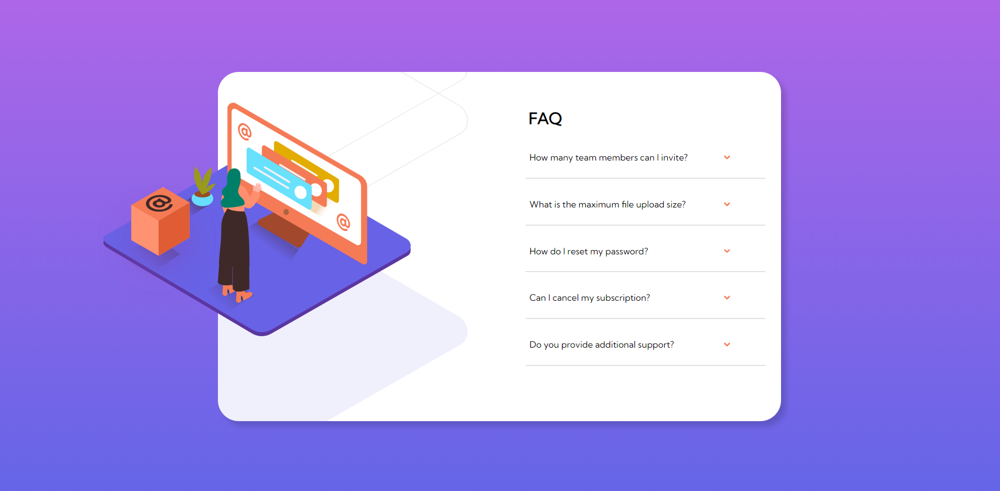
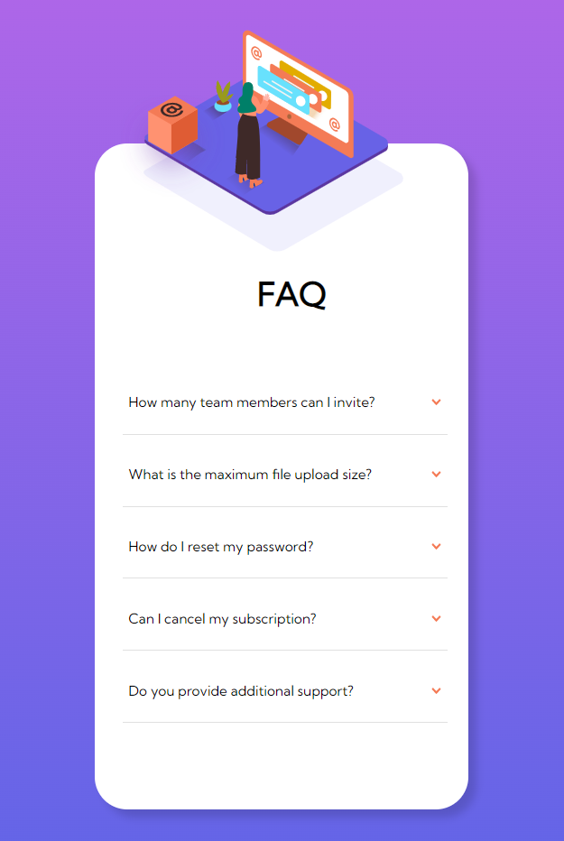

# Frontend Mentor - FAQ accordion card solution

This is a solution to the [FAQ accordion card challenge on Frontend Mentor](https://www.frontendmentor.io/challenges/faq-accordion-card-XlyjD0Oam). Frontend Mentor challenges help you improve your coding skills by building realistic projects. 

## Table of contents

- [Overview](#overview)
  - [The challenge](#the-challenge)
  - [Screenshot](#screenshot)
  - [Links](#links)
- [My process](#my-process)
  - [Built with](#built-with)
  - [What I learned](#what-i-learned)
- [Author](#author)

## Overview

### The challenge

Users should be able to:

- View the optimal layout for the component depending on their device's screen size
- See hover states for all interactive elements on the page
- Hide/Show the answer to a question when the question is clicked

### Screenshot



### Links

- Solution URL: [Add solution URL here](https://github.com/cassiamoraes/Faq-Accordion-Card/tree/main)
- Live Site URL: [Add live site URL here](https://cassiamoraes.github.io/Faq-Accordion-Card/)

## My process

### Built with

- Semantic HTML5 markup
- CSS custom properties
- Flexbox
- CSS Grid
- SCSS
- JS
- Mobile-first workflow
- [Styled Components](https://styled-components.com/) - For styles

### What I learned

I worked for do this page using javascript for the buttons, I used too SASS in my style.

To see how you can add code snippets, see below:

```html
<div class="accordion-collapse" id="accordionOne">
  <div class="accordion-body">
    You can invite up to 2 additional users on the Free plan. There is no limit on 
    team members for the Premium plan.
  </div>
</div>
```
```css
.accordion-collapse{
    margin-top: -0.5rem;
    margin-bottom: 1rem;
    display: none;
    font-size: 0.8rem;
}
```
```js
var listButtons = document.querySelectorAll('.div-btn')

listButtons.forEach(function(btn){
    btn.addEventListener('click', function(){

    var targetId = btn.getAttribute('data-target')
    var targetContent = document.getElementById(targetId)
    })
})
```

## Author

- LinkedIn - [Cassia Moraes](https://www.linkedin.com/in/cassia-moraes-797797139)
- Frontend Mentor - [@cassiality](https://www.frontendmentor.io/profile/cassiality)
